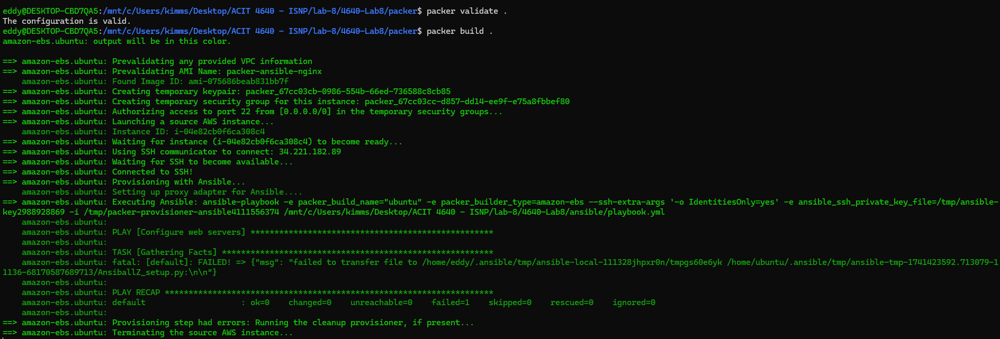

# 4640-Lab8



I have written the packer HCL code and successfully ran packer init and packer validate, but when I try to run packer build, I keep encountering the following error:

``` swift
amazon-ebs.ubuntu: fatal: [default]: FAILED! => {"msg": "failed to transfer file to /home/eddy/.ansible/tmp/ansible-local-111328jhpxr0n/tmpgs60e6yk /home/ubuntu/.ansible/tmp/ansible-tmp-1741423592.713079-11136-68170587689713/AnsiballZ_setup.py:\n\n"}
```

I couldn't fix the error on time, so I just submitted this screenshot and completed packer and terraform configuration codes.